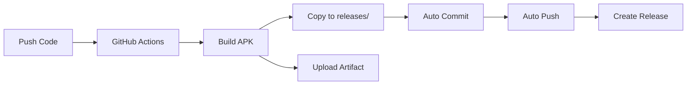

# 🤖 Système de Commit Automatique des APKs

## 📋 Vue d'ensemble

Cette branche utilise un système automatisé pour générer, versionner et committer les APKs directement dans le repository.

## ⚙️ Fonctionnement

### Workflow automatique

Quand vous pushez sur la branche `claude/mobile-platformer-apk-S4JEa`, GitHub Actions :

1. ✅ **Build l'APK** de release
2. ✅ **Nomme l'APK** : `tiny-platformer-v{version}-build{number}.apk`
3. ✅ **Copie dans** le dossier `releases/`
4. ✅ **Commit automatiquement** l'APK sur la branche
5. ✅ **Push** sur le repository
6. ✅ **Crée une release** GitHub avec l'APK attaché
7. ✅ **Upload comme artifact** (conservé 30 jours)

### Exemple de commit automatique

```
🤖 Auto-build: Add APK v1.0 build #42

Date: 2026-01-10 20:30:15
Version: 1.0
Build: 42
Branch: claude/mobile-platformer-apk-S4JEa
```

## 📁 Structure après build

```
TinyMobileApp/
├── releases/
│   ├── README.md
│   ├── .gitkeep
│   ├── tiny-platformer-v1.0-build1.apk    ← Auto-généré
│   ├── tiny-platformer-v1.0-build2.apk    ← Auto-généré
│   └── tiny-platformer-v1.0-build3.apk    ← Auto-généré
├── .github/workflows/
│   └── build-apk.yml                       ← Workflow configuré
└── .gitignore                              ← APKs autorisés dans releases/
```

## 🔍 Vérification des APKs

### Dans le repository

```bash
# Voir les APKs versionnés
git log --all --oneline --decorate -- releases/

# Lister les APKs disponibles
ls -lh releases/*.apk

# Historique des builds
git log --grep="Auto-build"
```

### Sur GitHub

1. **Dans le code** : Naviguez vers `releases/`
2. **Dans Actions** : Téléchargez les artifacts
3. **Dans Releases** : Téléchargez depuis les releases

## 📥 Récupération des APKs

### Méthode 1 : Clone du repository (avec APKs)

```bash
git clone https://github.com/ThomasPeligryCesi/TinyMobileApp.git
cd TinyMobileApp
git checkout claude/mobile-platformer-apk-S4JEa

# Les APKs sont directement disponibles
ls releases/
```

### Méthode 2 : Téléchargement direct

Sur GitHub, naviguez vers `releases/` et téléchargez le fichier APK.

### Méthode 3 : Via git

```bash
# Télécharger uniquement le dossier releases
git clone --depth 1 --filter=blob:none --sparse \
  https://github.com/ThomasPeligryCesi/TinyMobileApp.git
cd TinyMobileApp
git sparse-checkout set releases
git checkout claude/mobile-platformer-apk-S4JEa
```

## 🎯 Avantages de ce système

### ✅ Pour les développeurs
- Historique complet des builds dans Git
- Pas besoin de setup local Android
- Traçabilité complète (commit + build number)

### ✅ Pour les utilisateurs
- APKs facilement accessibles dans le repo
- Clone simple pour obtenir les APKs
- Pas besoin de compte GitHub pour télécharger

### ✅ Pour la distribution
- APKs versionnés et archivés
- Plusieurs versions disponibles simultanément
- Facile à partager (lien direct GitHub)

## 🔄 Gestion de l'espace

### Taille des APKs
- APK Release : ~30-40 MB
- APK Debug : ~40-50 MB

### Nettoyage périodique

Pour éviter un repository trop lourd, supprimez les anciens builds :

```bash
# Garder uniquement les 5 derniers builds
cd releases
ls -t *.apk | tail -n +6 | xargs rm -f

# Committer le nettoyage
git add releases/
git commit -m "🧹 Clean old APK builds"
git push
```

### Limite GitHub
- Fichiers < 100 MB : OK ✅
- Repository < 1 GB : Recommandé
- Nos APKs ~35 MB chacun

## 🛠️ Configuration

### Désactiver les commits automatiques

Si vous ne voulez pas committer les APKs :

Éditez `.github/workflows/build-apk.yml` et commentez :

```yaml
# - name: Commit APK to repository
#   if: startsWith(github.ref, 'refs/heads/claude/mobile-platformer-apk-')
#   run: |
#     git config --local user.email "github-actions[bot]@users.noreply.github.com"
#     ...
```

### Changer le pattern de nommage

Modifiez dans le workflow :

```yaml
cp android/app/build/outputs/apk/release/app-release.apk \
   releases/tiny-platformer-v${{ steps.version_info.outputs.version }}-build${{ github.run_number }}.apk
```

Remplacez par votre pattern préféré.

## 📊 Monitoring

### Voir l'historique des builds

```bash
# Logs des commits automatiques
git log --author="github-actions" --oneline

# Taille totale des APKs
du -sh releases/

# Nombre d'APKs
ls releases/*.apk | wc -l
```

### Dashboard GitHub Actions

- Allez dans Actions → Build Android APK
- Voyez tous les builds avec leurs statuts
- Téléchargez les logs et artifacts

## 🔐 Sécurité

### Signature des APKs
Les APKs sont signés avec une **debug keystore** incluse dans le repo.

⚠️ **Pour production** :
- Utilisez une vraie clé de release
- Stockez-la dans GitHub Secrets
- Ne committez JAMAIS la clé de production

### Fichiers sensibles exclus
Le `.gitignore` protège :
- `*.keystore` (sauf debug.keystore)
- `local.properties`
- Clés privées

## 📝 Notes importantes

1. **Commits automatiques** : Faits par `github-actions[bot]`
2. **Build numbers** : Incrémentés automatiquement par GitHub
3. **Version** : Définie dans `android/app/build.gradle`
4. **APKs dans releases/** : Exception au `.gitignore`

## 🚀 Workflow complet



## 🆘 Dépannage

### "Push failed" dans Actions
- Normal si aucun changement
- Le workflow continue quand même

### APK non committé
- Vérifiez les logs Actions
- Vérifiez les permissions du bot

### Trop d'APKs
- Nettoyez avec le script ci-dessus
- Configurez une rétention automatique

---

**Ce système permet une distribution fluide et automatisée des APKs tout en conservant un historique complet dans Git ! 🎮**
